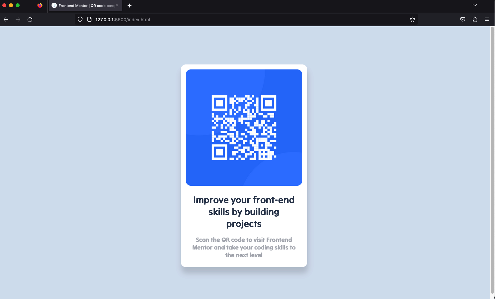

# Frontend Mentor - QR code component solution

## Table of contents

- [Overview](#overview)
  - [Screenshot](#screenshot)
  - [Links](#links)
- [My process](#my-process)
  - [Built with](#built-with)
- [Author](#author)

## Overview

### Screenshot

### Links

- Live Site URL: [https://qr-template.netlify.app/](https://qr-template.netlify.app/)

## My process

### Built with

- Semantic HTML5 markup
- CSS custom properties
- Flexbox
- Mobile-first workflow

## Author

- Website - Alvaro Mena Santos
- Frontend Mentor - [@amenas7](https://www.frontendmentor.io/profile/amenas7)
- Github - [@amenas7](https://github.com/amenas7)
